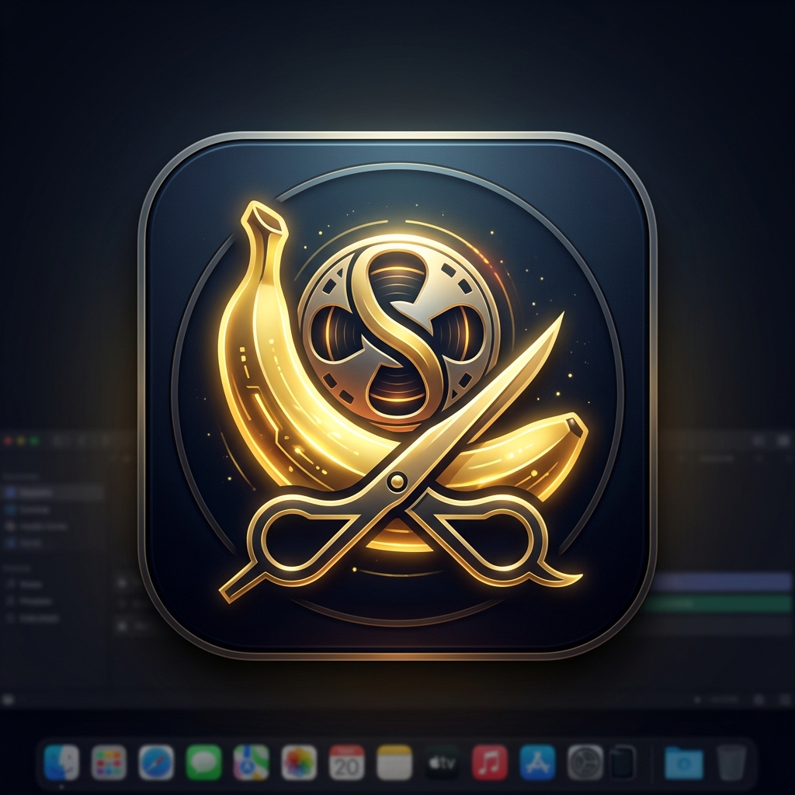
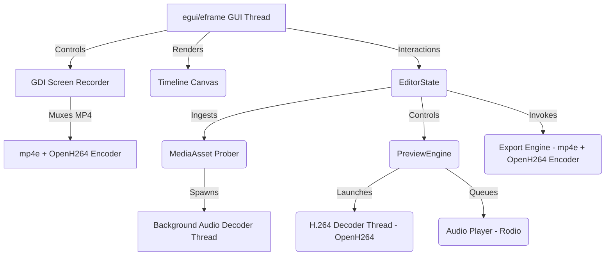

# SiloCut

<p align="center">
  
</p>

SiloCut is an ultra-lightweight, zero-dependency standalone Non-Linear Video Editor (NLE) and High-Performance Screen Recorder written in pure Rust. It packages a full timeline-based editing interface, GDI screen capturer, multi-track audio/video mixing, live frame preview, and H.264 rendering into a single standalone executable under **11MB**.

---

## Key Features

- **Standalone Single Binary**: Zero external system dependencies, no installers, no FFmpeg DLL installations. Just download the `.exe` and run.
- **Built-in GDI Screen Recorder**:
  - Zero-watermark, zero-dependency, full-resolution Windows screen capture.
  - Rayon-accelerated BGRA-to-RGB conversion for maximum CPU utilization.
  - On-the-fly H.264 compression and MP4 muxing.
  - Automatically imports finished recordings directly into the Project Media Bin for immediate editing.
- **Responsive egui UI**: Smooth GPU-accelerated editor interface with a timeline ruler, drag-and-drop media ingestion, and layout resizing.
- **Non-Destructive Editing State**:
  - Live timeline scrubbing, clip dragging, snapping, and edge trimming.
  - **Razor Tool**: Frame-accurate splitting of video/audio clips with auto-fade cleanup.
  - Adjustable track header controls (Mute, Hidden, Solo, Volume).
  - Adjustable clip fades (In / Out duration up to 5s).
- **Asynchronous Audio Decoding**: Non-blocking ingestion that decodes audio samples in background worker threads, preventing GUI freezes.
- **Real-Time Preview Engine**: Decoupled background video decoding thread that converts YUV420p to RGBA using CPU-optimized integer math.
- **Dynamic Audio Mixing**: Real-time multi-track mixer that dynamically queries the timeline, mixes overlapping samples, and plays them via `rodio`.
- **H.264 MP4 Exporter**: Decodes source clips sequentially, resizes them, encodes them using OpenH264, and packages them into a valid MP4 stream via a pure-Rust muxer.

---

## Technical Stack & Architecture



- **Core UI**: `egui` (0.34.3) + `eframe` (0.34.3)
- **Audio Probing & Decoding**: `symphonia` (0.6.0) for reading formats and extracting raw sample arrays.
- **Audio Output**: `rodio` (0.20.1) for low-latency backend audio output and real-time mixing queue.
- **Video Decoding/Encoding**: Statically linked `openh264` (0.9.3) via a pure Rust wrapper (linked at build-time).
- **Muxing**: `mp4e` (1.0.5) pure Rust MP4 stream writer.
- **Screen Capturing**: Windows GDI APIs (`windows-sys`).

---

## How to Build & Run

### Prerequisites

You need the Rust toolchain installed. On Windows, you also need a C compiler (e.g. MinGW/GCC or MSVC) installed and available in your `PATH` (required to compile the statically linked OpenH264 C++ bindings).

### Build and Run in Debug Mode

To launch the application in development mode:

```powershell
cargo run
```

### Build Optimized Release Executable

To generate the optimized release executable with embedded application icon:

```powershell
cargo build --release
```

The compiled standalone executable will be located at:
`target/release/silocut.exe` (on Windows).

- **Binary Size**: **10.71 MB** (fully optimized using LTO, symbol stripping, and size-optimized profiles).
- **Application Icon**: Embedded natively in the `.exe` file using `winres`.

---

## License

This project is open-source and available under the MIT License.
