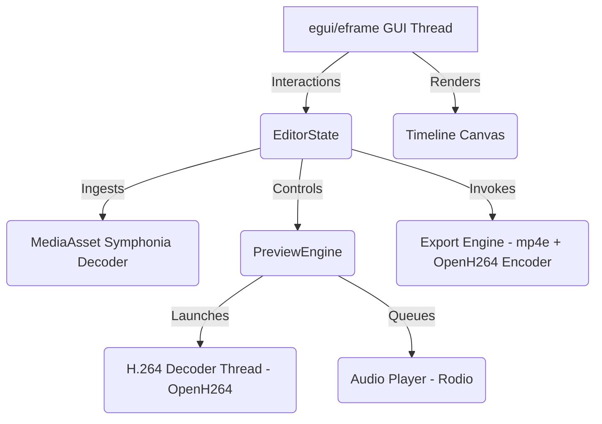

# SiloCut

<p align="center">
  
</p>

SiloCut is an ultra-lightweight, zero-dependency standalone Non-Linear Video Editor (NLE) written in pure Rust. It packages a full timeline-based editing interface, multi-track audio/video mixing, live frame preview, and H.264 rendering into a single standalone executable under **11MB**.

## Key Features

- **Standalone Single Binary**: Zero system dependencies, no installers, no global FFmpeg DLL installations. Just download the `.exe` and run.
- **Responsive egui UI**: Smooth GPU-accelerated editor interface with a timeline ruler, drag-and-drop media ingestion, and layout resizing.
- **Non-Destructive Editing State**:
  - 2 Video Tracks + 2 Audio Tracks.
  - Live timeline scrubbing, clip dragging, snapping, and edge trimming.
  - **Razor Tool**: Frame-accurate splitting of video/audio clips.
- **Real-Time Preview Engine**: Decoupled background video decoding thread that converts YUV420p to RGBA using CPU-optimized integer math.
- **Dynamic Audio Mixing**: Real-time multi-track mixer that dynamically queries the timeline, mixes overlapping samples, and plays them via `rodio`.
- **H.264 MP4 Exporter**: Decodes source clips sequentially, resizes them, encodes them using OpenH264, and packages them into a valid MP4 stream via a pure-Rust muxer.

---

## Technical Stack & Architecture



- **Core UI**: `egui` (0.34.3) + `eframe` (0.34.3)
- **Audio Decoding**: `symphonia` (0.6.0) for reading formats and extracting raw sample arrays.
- **Audio Output**: `rodio` (0.20.1) for low-latency backend audio output and real-time mixing queue.
- **Video Decoding/Encoding**: Statically linked `openh264` (0.9.3) via a pure Rust wrapper.
- **Muxing**: `mp4e` (1.0.5) pure Rust MP4 stream writer.

---

## How to Build & Run

### Prerequisites

You need the Rust toolchain installed. On Windows, ensure you have a MinGW C++ compiler available in your system path (e.g. `mingw-w64`) as it is required to compile the static C/C++ OpenH264 bindings.

### Build and Run in Debug Mode

To launch the application in development mode:

```powershell
# Set MinGW path (adjust if necessary)
$env:PATH="C:\Users\aboud\scoop\apps\mingw\current\bin;" + $env:PATH

# Run the app
cargo run
```

### Build Optimized Release Executable

To generate the optimized release executable:

```powershell
$env:PATH="C:\Users\aboud\scoop\apps\mingw\current\bin;" + $env:PATH
cargo build --release
```

The compiled standalone executable will be located at:
`target/release/silocut.exe`

- **Binary Size**: **10.68 MB** (fully optimized using LTO and symbol stripping).

---

## License

This project is open-source and available under the MIT License.
